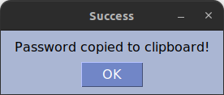

# 🔑 Password Generator 

Password Generator is a GUI python program created using PySimpleGUI, it allows you to quickly and easily generate secure passwords and copy them to the clipboard. 

# ⭐️ How it works

The generator operates by executing the 'password_generator' function when the 'Generate' button is clicked. 
Upon generating the password, you can easily copy it to your clipboard by clicking the 'Copy' button, which retrieves the password using the '-OUTPUT-' key.
This action simultaneously triggers a popup window to confirm that the password has been successfully copied to your clipboard.

# 🌄 Screenshots

